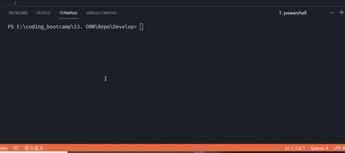

# E-Commerce Back End
## by Robert VanScoy
_______________________________________________________________
### Description 
* This project is the back end of an e-commerce website. It uses Sequelize to interact with a MySQL Database. The routes were tested with Insomnia. 
  
### License : 

  
* Info on license: https://opensource.org/licenses/MIT
_______________________________________________________________
### Installation Instructions:
* Need to npm i to instal node packages : MySQL2, Sequelize, and dotenv.

_______________________________________________________________

### Demo:

 * Link to YouTube Demo

https://youtu.be/c_ZdoNW-jUE

 * Initializing the db from project and seeding data

 * Get all data from all routes

 * POST UPDATE and DELETE for Products

 * POST UPDATE and DELETE for Tags

 * POST UPDATE and DELETE for Categories

_______________________________________________________________

### Main Language : 
* node.js

### Contribution Policy: 
* Send an email to me to discuss collaboration
_______________________________________________________________
### Test Cases:
* n/a
_______________________________________________________________
### Contact Me 

* https://github.com/vanscoyro
* rvans003@fiu.edu

### TABLE OF CONTENTS 
_______________________________________________________________
* [Description](#description)
* [License](#license-)
* [Installation](#installation-instructions)
* [Demo](#demo)
* [Main Language](#main-language-)
* [Contribution Policy](#contribution-policy)
* [Test Case](#test-cases)
* [Contact Me](#contact-me)

    
  
